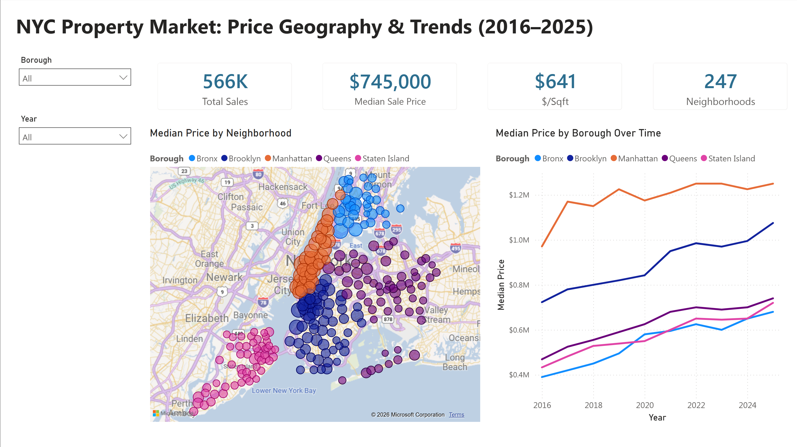

# NYC Property Price Analytics (2016–2025)

An end-to-end analytics project on **566,000 real New York City property sales**,
covering the full workflow: data cleaning, a relational database, SQL analysis,
three machine-learning analyses (regression, clustering, causal inference), and an
interactive Power BI dashboard with map visuals.

**Data source:** [NYC Department of Finance – Annualized Property Sales](https://www.nyc.gov/site/finance/property/property-annualized-sales-update.page),
via data.gov.
**Coverage:** 2016–2025 · all five boroughs · 262 neighborhoods · 566,285 genuine
market sales.

---

## Key findings

**1. Property size and location predict price — but only to a point.** A random
forest predicts sale price from size, location, age, and type with an **R² of
0.55** and a typical (median) error around **$183,000**. That the model explains
just over half the variance is itself the finding: physical attributes drive price,
but condition, renovation, and timing — none recorded in the data — account for the
rest. A model claiming to explain 95% of NYC prices from these fields would be a
red flag for leakage.

**2. NYC neighborhoods form four distinct market segments.** K-means clustering of
~240 neighborhoods surfaces a premium core (Manhattan — roughly 3× the price per
square foot of anywhere else) that separates sharply, while mid-market
neighborhoods split by **building age and density**, not price. Neighborhoods at
similar price points turn out to be genuinely different kinds of markets.

**3. COVID's impact on Manhattan prices was real but half as large as it looks.**
A difference-in-differences analysis finds Manhattan's price per square foot fell
about **25% relative to Brooklyn** after March 2020 — but controlling for which
properties actually sold, the genuine like-for-like effect is closer to **11%**.
About half the apparent "urban flight" price drop was a composition shift in what
sold, not a fall in comparable values.

---

## Project architecture

```
NYC-Property-Analytics/
├── data/
│   ├── raw/                          # original NYC sales export
│   └── processed/                    # cleaned, analysis-ready sales
├── scripts/
│   ├── clean_property_data.py        # parse, filter non-sales, derive features
│   ├── load_to_mysql.py              # build the MySQL database (geography + sales)
│   └── export_for_powerbi.py         # export views/aggregates for the dashboard
├── sql/
│   ├── analysis_views.sql            # analysis views (price by borough, neighborhood, type)
│   ├── data_quality_checks.sql       # validation queries
│   └── example_queries.sql           # guided analytical queries
├── notebooks/
│   ├── price_prediction_regression.ipynb      # regression (centerpiece)
│   ├── property_segmentation_clustering.ipynb # k-means segmentation
│   └── covid_price_impact_causal.ipynb        # difference-in-differences
└── dashboard/
    ├── nyc_property_dashboard.pbix   # two-page Power BI report
    ├── dashboard_preview.png         # page 1 (embedded below)
    ├── dashboard_page2.png           # page 2
    └── data/                         # CSV exports the dashboard reads
```

---

## 1. Data cleaning

NYC's raw sales file has well-known quirks that must be handled before analysis.
`clean_property_data.py`:

- **Parses prices from text** — values arrive as `"$1,590,000 "` with dollar signs,
  commas, and trailing spaces.
- **Removes non-market transfers** — about **31% of rows (262,138)** are $0 "sales":
  deed transfers between family members, LLCs, or estates, not genuine market
  transactions. Recognizing and excluding these is essential; leaving them in would
  destroy any price analysis. A further 17,184 rows outside a $10k–$50M sanity range
  are dropped.
- **Normalizes categories and boroughs** — collapses inconsistent spacing in
  building-class names and maps borough codes 1–5 to names.
- **Derives features** — price per square foot, building age, simplified property
  type.

The result is **566,285 genuine sales** with a median price of **$745,000** — a
sane, workable dataset.

**A modeling note carried through the project:** only ~274k sales report gross
square footage. Co-ops list ownership *shares* rather than square footage, so they
have no sqft. Because square footage is the strongest price predictor, the
regression models the sqft-reporting subset rather than imputing the single most
important feature (which would risk leakage) — a scope stated openly rather than
hidden.

---

## 2. Relational database (MySQL)

At 566k rows the database does real work — indexing and aggregation matter at this
scale in a way they wouldn't for a few thousand rows. `load_to_mysql.py` builds a
**star schema**:

- **`geography`** (dimension) — one row per borough/neighborhood area (~260 rows),
  with a surrogate integer key. Normalizing geography avoids repeating neighborhood
  text across half a million sale rows.
- **`sales`** (fact) — one row per transaction, referencing `geography` by foreign
  key.

Indexes are created on the columns used for filtering and grouping (geography,
sale year, property type) so aggregate queries stay fast across 566k rows. The
loader inserts in chunks (half a million rows exceeds a single insert) and applies
the analysis views, then runs a suite of data-quality checks.

**Data-quality checks** (each returns rows only when something is wrong, so a clean
load reports all passing): price-in-range, no negative square footage, sale years
in range, no impossible (negative) building ages, referential integrity between
sales and geography, and primary-key uniqueness.

---

## 3. SQL analysis

Views in [`sql/analysis_views.sql`](sql/analysis_views.sql) centralize the common
aggregations (price by borough-year, by neighborhood, by property type) so the
notebooks and dashboard read consistent definitions.

The example queries in [`sql/example_queries.sql`](sql/example_queries.sql)
demonstrate:

- **Window functions** — `LAG()` for year-over-year price change, and
  `RANK() OVER (PARTITION BY borough ...)` to rank neighborhoods *within* each
  borough in a single query.
- **`WHERE` vs `HAVING`** — filtering individual sales before grouping versus
  filtering aggregated neighborhood groups after, a distinction `WHERE` alone
  cannot express.
- **A first look at the COVID question** — a pre/post March-2020 price comparison by
  borough, which the causal notebook then analyzes rigorously.

---

## 4. Price prediction — regression (centerpiece)

[`price_prediction_regression.ipynb`](notebooks/price_prediction_regression.ipynb)
predicts sale price from square footage, land size, building age, unit count,
borough, and property type.

**Key decisions:**

- **Log-transform the target.** Sale price is extremely right-skewed (skew ≈ 8.0).
  Logging it produces a near-symmetric distribution (skew ≈ 0.4), so the model
  optimizes percentage error rather than being dominated by a handful of luxury
  sales. The notebook shows both distributions to make the reason visible.
- **Pipelines prevent leakage.** Imputation and one-hot encoding run inside a
  scikit-learn `Pipeline`, so transformations fit on training data only.
- **Two models compared.** A linear baseline against a random forest:

| Model | R² (log) | MAE | Median error |
|---|:---:|:---:|:---:|
| Linear regression | 0.36 | $739k | $227k |
| Random forest | **0.55** | **$530k** | **$183k** |

The random forest's gain over the linear baseline comes from capturing
**interactions** — an extra 500 sq ft is worth far more in Manhattan than in the
Bronx, which a purely additive linear model can't represent. Feature importance is
dominated by square footage and borough, exactly as domain intuition predicts.

An R² of 0.55 is honest for raw NYC sales data: structural attributes explain much
of price, but condition, renovation quality, and sale timing — none in the data —
account for the rest.

---

## 5. Neighborhood segmentation — clustering

[`property_segmentation_clustering.ipynb`](notebooks/property_segmentation_clustering.ipynb)
groups ~240 neighborhoods into market segments with k-means, using median price,
price per square foot, building age, and density.

- **Standardized features** — required for distance-based clustering so
  large-magnitude features (price) don't swamp small ones (unit count).
- **k chosen with the elbow method and silhouette score**, landing on four
  interpretable segments.
- **Outliers handled explicitly** — a few "neighborhoods" are actually commercial
  districts (a mall area with ~99 units per building, near-zero residential price
  per sqft) that distorted the clustering; these were removed as a documented
  judgment call.

The premium core (Manhattan) separates sharply; the mid-market splits by age and
density rather than price — the substantive finding.

---

## 6. COVID price impact — causal inference

[`covid_price_impact_causal.ipynb`](notebooks/covid_price_impact_causal.ipynb) uses
**difference-in-differences** to estimate whether COVID *caused* Manhattan prices to
fall relative to less-dense areas.

- **Control group selected by testing parallel trends.** DiD requires the treatment
  and control groups to move together before the intervention. Brooklyn tracks
  Manhattan closely pre-COVID (correlation ≈ 0.8); the more suburban Staten Island
  did not (≈ 0.3), so Brooklyn is the control. Choosing the control by testing the
  assumption — rather than picking one arbitrarily — is central to a credible design.
- **The DiD estimate.** In a tight 2019-vs-2020/21 window, Manhattan's price per
  square foot fell ~25% relative to Brooklyn (highly significant).
- **Ruling out a composition shift.** Re-estimating with controls for property
  characteristics cuts the effect to ~11%. **About half the raw divergence was a
  change in *what* sold, not a change in prices** — a naive before/after comparison
  would have overstated the pandemic's true price impact by roughly double.

The gap between the raw and controlled estimates is the most interesting result:
it shows why controlling for composition matters in observational causal work.

---

## 7. Interactive dashboard

A two-page Power BI report with slicers synced across pages.



**Page 1 — The NYC Market:** KPI summary (total sales, median price, price per
sqft, neighborhood count), a **bubble map** of neighborhoods sized by price, and a
median-price trend by borough. The map uses the dataset's latitude/longitude to
plot each neighborhood geographically.

**Page 2 — Price & Property:** a size-vs-price scatter (the regression relationship,
visualized, with ~27k sampled sales colored by borough), average price by property
type, and a leaderboard of the most expensive neighborhoods.

Built on CSV exports of the MySQL views, keeping the report self-contained and
portable. Uses DAX measures (e.g. a true median price, since Power BI cards default
to average) computed from row-level data.

---

## Tech stack

**Python** (pandas, scikit-learn, statsmodels) · **MySQL** (star schema, analytical
views, data-quality checks) · **Power BI** (two-page interactive report with maps,
DAX) · **Git/GitHub**

## Reproducing this project

**Getting the raw data:** the raw sales file (`export.csv`, ~151 MB) is too large for
GitHub. Download the NYC Citywide Annualized Calendar Sales dataset from
[data.gov](https://catalog.data.gov/dataset/nyc-citywide-annualized-calendar-sales-update)
and place it at `data/raw/export.csv` before running the pipeline.

```bash
# 1. Install dependencies
pip install -r requirements.txt

# 2. Clean the raw sales data
python scripts/clean_property_data.py

# 3. Load into MySQL (set MYSQL_PASSWORD in your environment first)
python scripts/load_to_mysql.py

# 4. Export views for the dashboard
python scripts/export_for_powerbi.py
```

Notebooks connect to the MySQL database directly and can be run in any order after
step 3.
